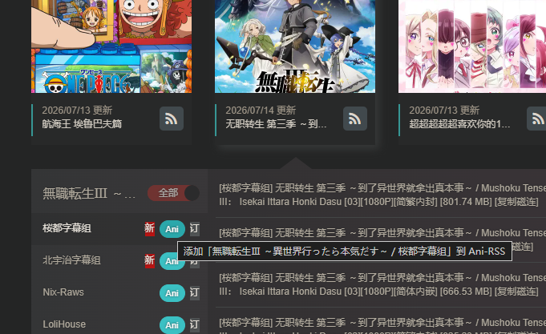

# Ani-RSS Mikan 订阅助手

在蜜柑计划（Mikan）页面一键把番剧订阅添加到 [Ani-RSS](https://github.com/wushuo894/ani-rss)。

默认适配：

- 官方站：`https://mikanani.me/`、`https://mikanime.tv/`
- 镜像站：`https://mikan.tangbai.cc/`
- Ani-RSS：`http://192.168.233.7:17789/`

## 功能

- 在番剧详情页 / 首页展开后，每个**字幕组**旁注入 **Ani** 按钮
- 必须选择字幕组订阅（不提供整部一键订阅）
- 调用 Ani-RSS 官方接口：`POST /api/rssToAni` → `POST /api/addAni`
- 支持登录鉴权（密码自动 MD5）、API Key、IP 白名单/免登录
- 可选：把镜像站 RSS 主机改写为 Ani-RSS 服务器可访问的域名

## 安装（Chrome / Edge）

1. 打开 `chrome://extensions/`（Edge：`edge://extensions/`）
2. 打开右上角 **开发者模式**
3. 点击 **加载已解压的扩展程序**
4. 选择本目录：`tool-anirss-extension`
5. 点击插件图标，填写 Ani-RSS 地址并 **测试连接** / **保存**

### 推荐配置

| 项 | 建议值 |
| --- | --- |
| Ani-RSS 地址 | `http://192.168.233.7:17789` |
| 用户名 / 密码 | 与 Ani-RSS 后台一致；若已开 IP 白名单可留空 |
| API Key | 可选，在 Ani-RSS「登录设置」里配置后更稳 |
| RSS 主机替换 | 用官方站时一般**留空**；仅当 RSS 域名 Ani-RSS 访问不了时再填 |

## 使用

**番剧详情页**

1. 打开例如：`https://mikanani.me/Home/Bangumi/xxxx`
2. 在目标**字幕组**右侧点击 **Ani**（必须选字幕组，无整部订阅按钮）

**首页**

1. 打开 `https://mikanani.me/`
2. **点击番剧封面展开**字幕组列表
3. 每一行：`字幕组名 …… [Ani] [订]`，点 **Ani** 即可

成功后右上角 toast 持续到完成；到 Ani-RSS 后台即可看到新订阅。

### 界面预览

字幕组旁的 **Ani** 按钮（与蜜柑原生「订」并排）：



## 更新说明（重要）

本插件为**本地解压加载**，**不会自动更新**。

改代码后请：

1. 打开 `chrome://extensions/`
2. 在本插件卡片上点 **重新加载**（刷新图标）
3. **刷新**蜜柑页面（F5）后再试

仅重启浏览器不一定加载到最新 content script。

## 工作原理

```
蜜柑页面字幕组
  → RSS: /RSS/Bangumi?bangumiId=xxx&subgroupid=yyy
  → Ani-RSS /api/rssToAni  （解析标题/BGM/季数等）
  → Ani-RSS /api/addAni    （写入订阅并可选立即下载）
```

鉴权方式（与官方 WebUI 一致，任一通过即可）：

- `Authorization` 请求头（登录后 token）
- `x-api-key` / `api-key` / 查询参数 `s`
- IP 白名单

## 目录结构

```
tool-anirss-extension/
├── manifest.json
├── background.js
├── lib/
│   ├── api.js
│   └── md5.js
├── content/
│   ├── mikan.js
│   └── mikan.css
├── popup/
│   ├── popup.html
│   ├── popup.js
│   └── popup.css
├── icons/
├── docs/
│   └── screenshot-ani-button.png
└── README.md
```

## 注意

- 扩展需要能访问你的 Ani-RSS 内网地址（与浏览器同一网络）
- Ani-RSS 服务器也需要能访问 RSS 源（镜像或官方蜜柑）；访问不了时使用「RSS 主机替换」
- 重复添加同名同季订阅时，Ani-RSS 可能报错或按后台「自动替换」策略处理

## 许可

MIT（本扩展）；Ani-RSS 本身遵循其项目许可证。
